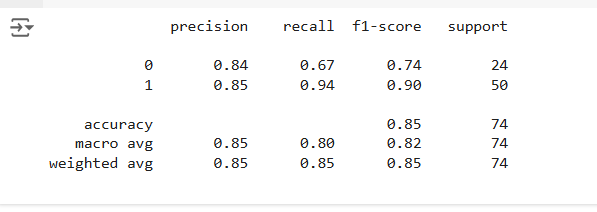

# Ex.No: 13 Rainfall Prediction  – Use Supervised Learning  
### DATE:  24.10.2024                                                                       
### REGISTER NUMBER : 212222040086
### AIM: 
To write a program to train the classifier for rainfall prediction based on various factor.

###  Algorithm:

1. Data Collection: Collect historical weather data, including temperature, humidity, wind speed, atmospheric pressure, and past rainfall data.

2. Preprocessing:

Clean and normalize the data.
Select important features (temperature, humidity, etc.) for predicting rainfall, or create new features to enhance model accuracy.
Algorithm Selection:

3. For predicting rainfall amount (regression): Use models like Linear Regression, Decision Tree Regression, or Random Forest Regression.
For predicting if it will rain or not (classification): Consider Logistic Regression, Decision Trees, or Random Forest.
Training & Testing:

4. Split the data into training and testing sets.
Train the model on the training set, then evaluate its performance on the test set using metrics like Mean Squared Error (for regression) or accuracy (for classification).
Optimization & Deployment:

5. Fine-tune hyperparameters for better accuracy.
Deploy the model if real-time predictions are needed.

### Program:

```py

import numpy as np
import pandas as pd
import matplotlib.pyplot as plt
import seaborn as sb

from sklearn.model_selection import train_test_split
from sklearn.preprocessing import StandardScaler
from sklearn import metrics
from sklearn.svm import SVC
from xgboost import XGBClassifier
from sklearn.linear_model import LogisticRegression
from imblearn.over_sampling import RandomOverSampler

import warnings
warnings.filterwarnings('ignore')

df = pd.read_csv('Rainfall.csv')
df.head()

df.rename(str.strip,
          axis='columns',
          inplace=True)

df.columns

for col in df.columns:

  # Checking if the column contains
  # any null values
  if df[col].isnull().sum() > 0:
    val = df[col].mean()
    df[col] = df[col].fillna(val)

df.isnull().sum().sum()

plt.pie(df['rainfall'].value_counts().values,
        labels = df['rainfall'].value_counts().index,
        autopct='%1.1f%%')
plt.show()

features = list(df.select_dtypes(include = np.number).columns)
features.remove('day')
print(features)

plt.subplots(figsize=(15,8))

for i, col in enumerate(features):
  plt.subplot(3,4, i + 1)
  sb.distplot(df[col])
plt.tight_layout()
plt.show()

import matplotlib.pyplot as plt
from sklearn.metrics import ConfusionMatrixDisplay
from sklearn import metrics

ConfusionMatrixDisplay.from_estimator(models[2], X_val, Y_val)
plt.show()

print(metrics.classification_report(Y_val,
                                    models[2].predict(X_val)))


```

### Output:



### Result:
Thus the system was trained successfully and the prediction was carried out.
